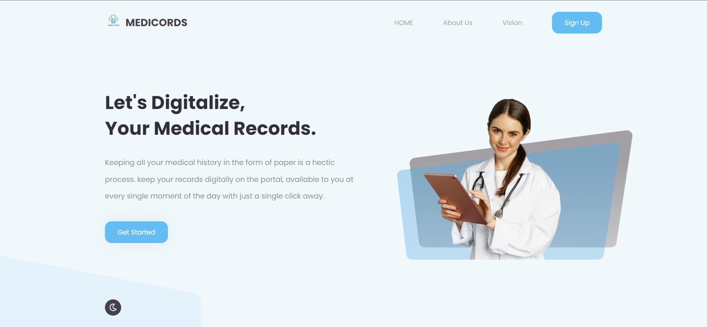
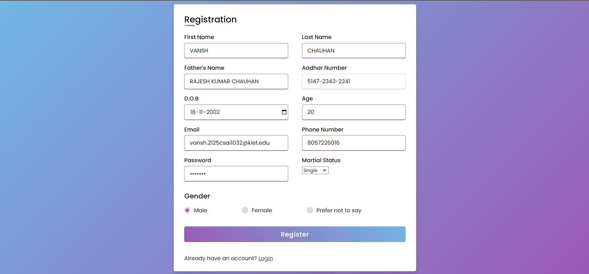
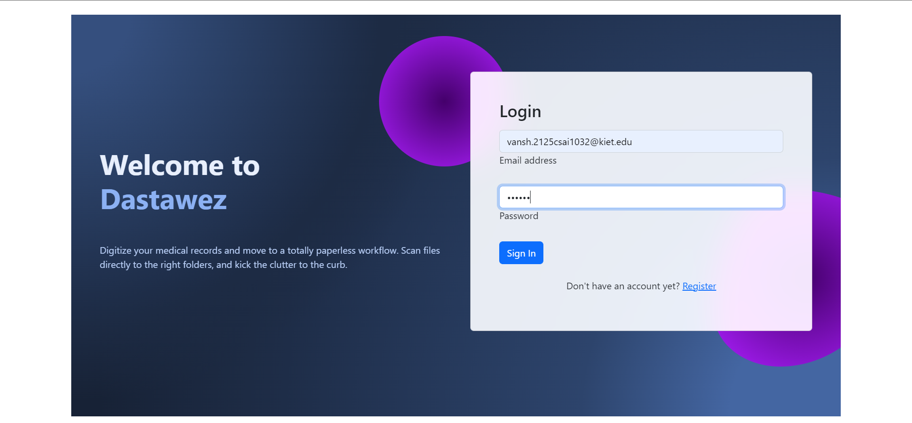
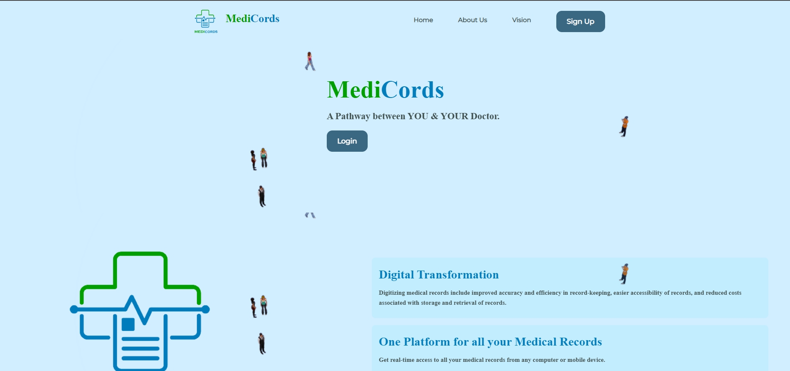
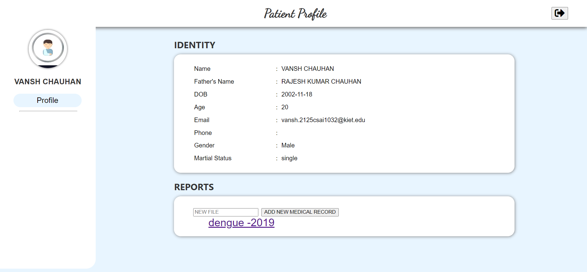
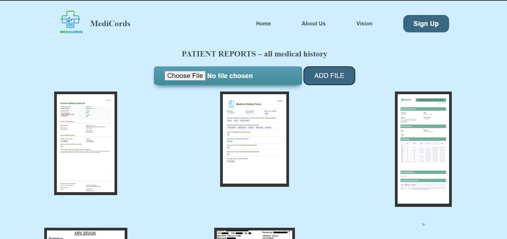

<h1 align="center">
    <b>MediCords - A Pathway between you & your Doctor</b> 
<br>
</h1>


<p align="center">
  <a href="#"></a>
</p>


## What is this for?
MediCords is a centralized portal for everyone to upload/store their Medical Records. It is a two way path for both patient and hospital/doctor to access, update or modify the health records. It is a user friendly website where they can easily upload there patient’s history, clinical findings, diagnostic test results, pre and postoperative care, patient’s progress and medication. These documents can be accessed by the doctor or medical institute with the permission of the user. There is no more need to carry your medical records when you to for consultancy to a new hospital and these records are accessible to the user anytime.

## Getting Started

### •Landing Page:
Allows the user to register their account by filling their Name, , Password.



### •Sign Up Page:
If the user has been registered on the app, can login by passing the credentials.



### •Login Page:
After the user logged in, a simple profile with the user's username and password <br>displayed with a session Logout button.



### •Home Page:
If the user forget his/her password, can reset by entering the registered Email id <br>and reset the password.



### •User Profile:
If the user forget his/her password, can reset by entering the registered Email id <br>and reset the password.



### Technologies Used:


- **[Node.js](https://nodejs.org/en/)**
- **[Node Package Manager](https://www.npmjs.com/get-npm)**
- **[MongoDB (Atlas)](https://www.mongodb.com/cloud/atlas)**

## Installing
--npm i

## To Run the App

node server.js
```

The server will start Running on
+ http://localhost:3000/


#� �M�E�D�I�_�C�O�R�D�S�
�
�"# MEDI_CORD" 
